<p align='center'></p>

## What is RTL?
RTL (Ride The Lightning) is a full function, device agnostic, web user interface to help manage lightning node operations.RTL is available on LND and C-Lightning implementations.

Visit the development repository [ShahanaFarooqui/RTL](https://github.com/ShahanaFarooqui/RTL) for more information.  
Follow [@RTL_App](https://twitter.com/rtl_app) on Twitter for important announcements.

## RTL-Design
This is the GitHub repository for the design work stream of RTL. It exists as a way to  mitigate an issue commonly found in FOSS projects, where the design work happens on an ad hoc basis by contributors, most of the times using proprietary software and files which are not accessible to all, and that are not stored in a common place, so as contributors come and go from the project these can get lost.

By using git we make sure that all the work and decisions are tracked over time, that the files are stored and available to everyone in a common place and with the added bonus that the design and dev repositories can now be tied together streamlining the work process and increasing collaboration between developers and designers and if that is not enough, by doing all of this in git, now the design work will also  be control versioned by default ( 🤯) albeit with some caveats that will be explained bellow.

For all this to function as intended, there's a workflow in place that needs to be followed by contributors. Its based on the popular [A successful Git branching model](https://nvie.com/posts/a-successful-git-branching-model/) (Gitflow) by [Vincent Driessen](https://nvie.com/about/), but adapted to a design process.

## Gitflow ❤️ Design
Gitflow design as mentioned above is a git workflow for designers and design work. Its meant to be open, platform agnostic and help minimise dependencies on proprietary design software and increase collaboration.

With git at the heart of everything, we get to take advantage of a lot state of the art features in project management/development, such as controlled access, review process, feedback systems,  version control, preview changes in context, side-by-side Diffs, detailed history of changes and more. Something that developers had available for years, but that designers never took advantage off.

#### Workflow

<p align="left">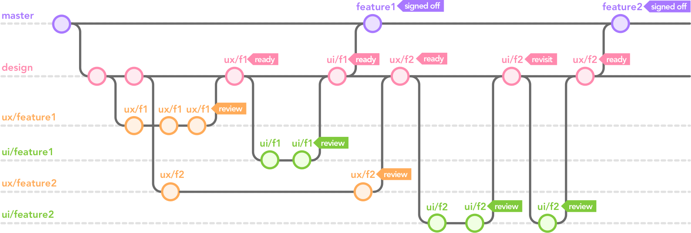</p>

##### Main Branches
* master
* design

The **master** branch is where you can find all the signed off work ready for implementation. This means the work you encounter there has been discussed, reviewed and accepted for development.

The **design** branch is where the **feature** branches come together in order to be reviewed before being accepted and ready to be merged to **master**.

##### Supporting Branches

* ux/feature
* ui/feature

Feature branches have two separate work streams one for UX and one UI and are named accordingly. Ideally they follow a certain order in the workflow.

As an example we might have an upcoming feature named **helpsystem**, with this, a UX feature branch should be created and named **ux/helpsystem** and this where the user experience work will be done. When the UX is finalised and ready for review, the branch will be pushed and a pull request created to merge it to **design**, this is where the review process takes place. If no problem arises, the **ux/helpsystem** pull request is accepted and the branch merged into design.

At this point the feature is ready to progress  into UI design. If it's picked up a new feature branch shall be created and named **ui/helpsystem** and the UI work can start. When the UI work is finalised the UI branch will follow the same steps as the UX counterpart and should be pushed and a pull request created to start the review process and merge it to **design**.

At this point if everything went to plan and the work reviewed and accepted we have both the **ux/helpsystem** and **ui/helpsystem** branches merged in **design**, so now the last step before being ready for development, is to create pull request in order to merge **design** into the **master** branch.

Well this is gist of it, and there is a lot more to it, but this is the foundation, we will explain further concepts further down.

## Contributing
First things first, thanks for showing interest in contributing! 🙌

Bellow you can find a step by step guide on how to contribute to RTL and follow the **gitflow design** workflow.  
We are still experimenting with it, so if you have any suggestions on how to improve it, please get in touch!


### Table of contents
* [Software Recommendations](#software-recommendations)
* [Prerequisites](#prerequisites)
* [Getting Started](#getting-started)
 * [Github Desktop Application](#github-desktop-application)
   *  [Step 1 - First Launch](#step-D1---first-launch)
   *  [Step 2 - Clone the Repo](#step-D2---clone-the-repo)
   *  [Step 3 - Design Branch](#step-D3---design-branch)
   *  [Step 4 - Feature Branches](#step-D4---feature-branches)
   *  [Step 5 - Do the Work](#step-D5---do-the-work)
   *  [Step 6 - Commit the Changes](#step-D6---commit-the-changes)
   *  [Step 7 - Push Changes to Github](#step-D7---push-changes-to-github)
   *  [Step 8 - Do More Work](#step-D8---do-more-work)
   *  [Step 9 - Push and Pull Request](#step-D9---push-and-pull-request)
   *  [Step 10 - Pull Request](#step-D10---pull-request)
 * [Terminal](#terminal)
   * [Step 1 - Clone the Repo](#step-t1---clone-the-repo)
   * [Step 2 - Switch to Design Branch](#step-t2---switch-to-design-branch)
   * [Step 3 - Create Feature Branch](#step-t3---create-feature-branch)
   * [Step 4 - Do The Work](#step-t4---do-the-work)
   * [Step 5 - Add and Commit Changes](#step-t5---add-and-commit-changes)
   * [Step 6 - Push Changes to Github](#step-t6---push-changes-to-github)
   * [Step 7 - Pull Request](#step-t7---pull-request)

#### Software Recommendations
We want to keep the workflow open to anyone who wants to contribute, so we are trying to focus on using open file formats that can be easily accessible by others and are not dependant on proprietary software.

**Free open source software you can use:**

* Inkscape (Vector graphics editor) - https://inkscape.org/
* GIMP (Image editor) - https://www.gimp.org/

#### Prerequisites
The step by step guide will be shown using the Github Desktop App and also via the terminal. Choose whatever you're most comfortable with.

* [Github Desktop App](https://desktop.github.com)
* [Git for Command Line](https://git-scm.com/) (Optional if you want to use the terminal)

#### Folder structure
This is the folder structure being used to keep things organised and manageable for all of us. When you are ready to start working on a feature and you've cloned the repo, you will have to create a folder for the said feature in the directory and that will depend on what implementation it is for, **lnd** or **cligtning** and name the folder after the feature.

**ui** - User interface design work.  
**ux** - User experience design work.

Inside these you will find:  

**exports** - Separate PNGs exports of your artboards.  
**source** - Editable files in open file formats, but also include the proprietary if available.

Inside **source** create folders named after the file extension. Examples bellow.

ux - **svg** / **sketch**  
ui - **xcf** / **psd**

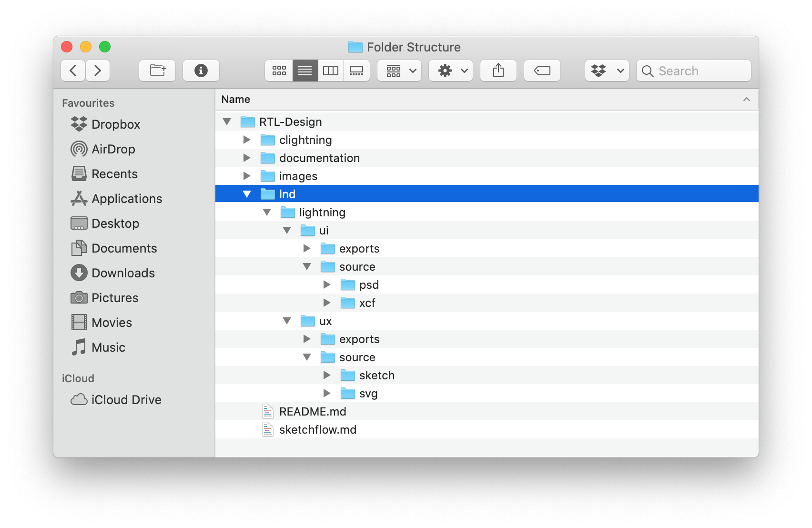

#### Getting started

This step by step guide will walk you through the basics of **Gitflow Design** in **10 easy steps**.   

It will cover, cloning the RTL-Design repo, creating a new feature branch, pushing your changes to github and creating a pull request to get your work reviewed. All this is shown  through both the desktop application and via terminal.

#### Github Desktop application
If you're not familiar with the terminal or command line applications, the Github Desktop application is the perfect solution. It works perfectly out of the box and makes interacting with git a lot easier.

##### Step D1 - First Launch
Launch the Github Desktop app and click to `Clone a repository from the Internet`
<p>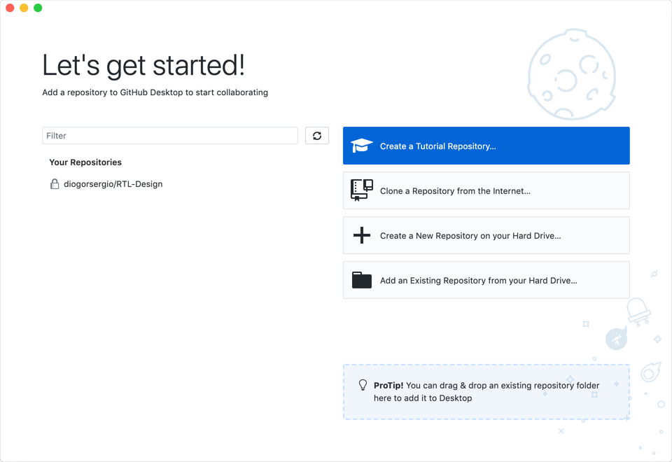</p><br>

##### Step D2 - Clone the Repo
Enter the RTL-Design repository URL or username/repo:  `diogorsergio/RTL-Design`
<p>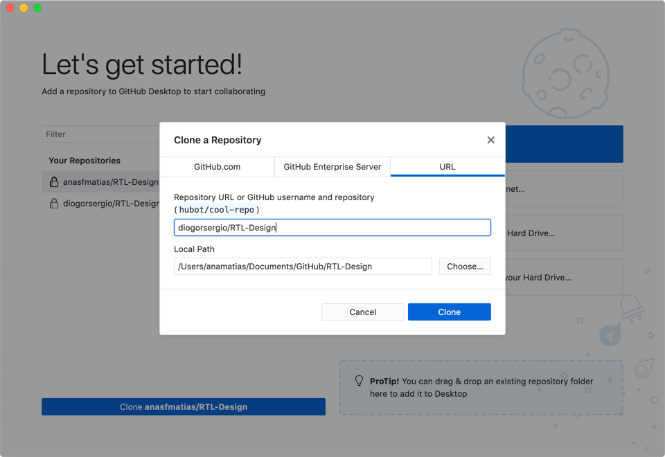</p><br>

##### Step D3 - Design Branch
Switch from the **master** branch to **design**.  
<p>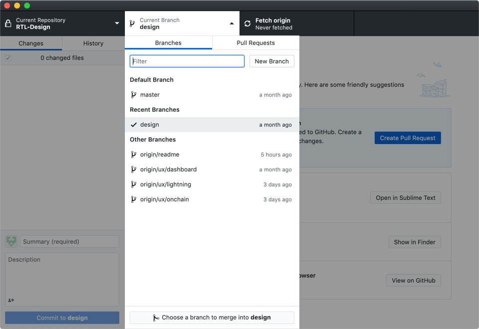</p><br>

##### Step D4 - Feature Branches
Create a new feature branch based on the **design** branch. There are two types of prefix for feature branches **ux/** and **ui/** and these are based on the type of work to be done. Prefixes should be followed by the feature name e.g.: **ux/lightning**.
<p>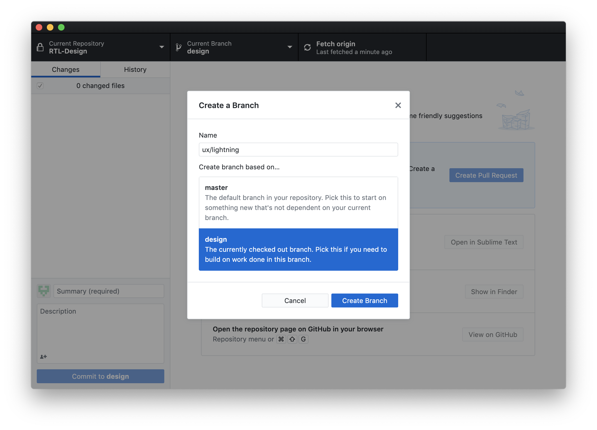</p><br>

##### Step D5 - Do the work
At this point you are ready to start working, but please make sure you follow the correct folder structure when creating your files.
<p>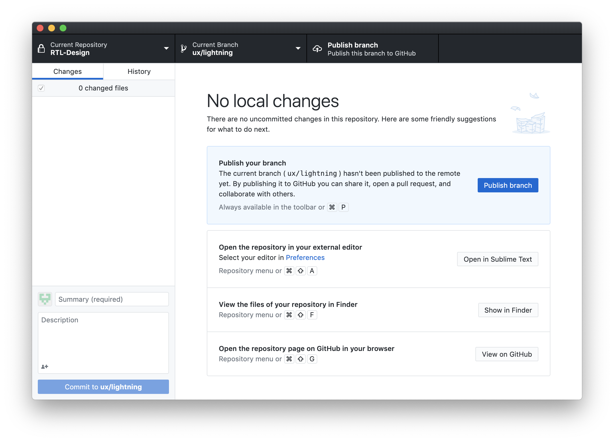</p><br>

##### Step D6 - Commit the Changes
When you finish a design iteration and are ready to show it to gather feedback, you will have to **commit** the changes you just made so they can be pushed to github for everyone to see. Commit titles should start with **[UX]** or **[UI]** accordingly to the work they include and a couple words describing the scope of the work. The **description** field is optional.  
 <p>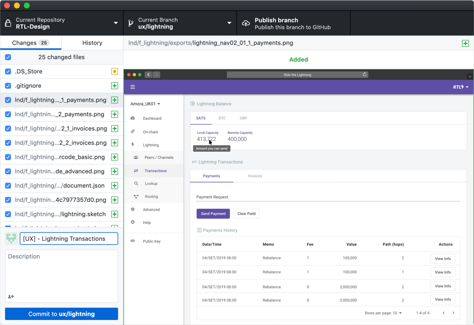</p><br>

##### Step D7 - Push Changes to Github
 Once your changes are committed, they are still local and not available in github, to make them available for everyone you will have to **publish** this branch.
 <p>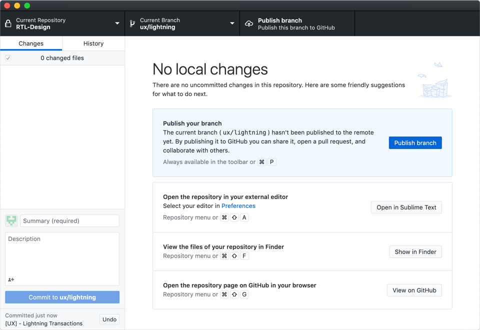</p><br>

##### Step D8 - Do more work
If your work still isn't finished, you can continue to work on your local files and do more changes, and these will be added for the next commit. At this point you can also take advantage of the Diff visualiser and check the differences between the current commit and the branch, and if everything seems okay, you can **commit** the changes and **push** them afterwards as you've done before.
<p>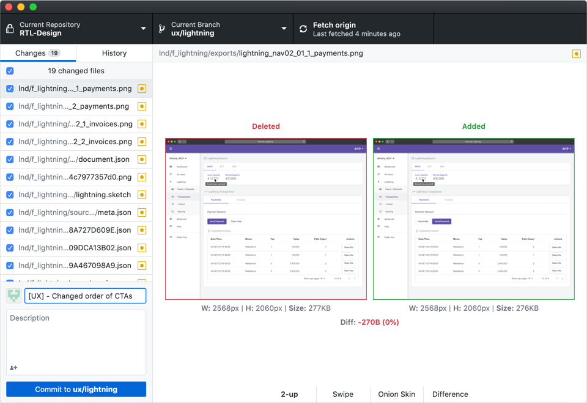</p><br>

##### Step D9 - Push and Pull Request
The changes are now pushed and available for everyone to see in github, so the last step is to get them reviewed by the design team. In order to do this, you will have to create a **pull request**
<p>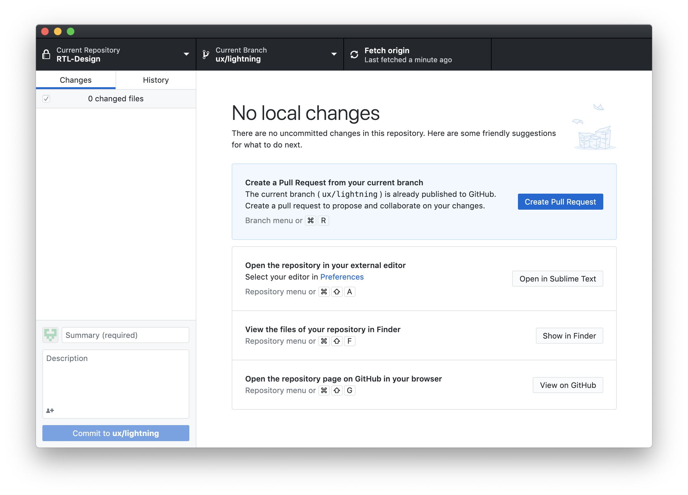</p><br>

##### Step D10 - Pull Request
This will open github on your browser and show the **pull request** interface. Select **design** as the base, the title should have the prefix of the work done **[UX/UI]** and write a description about the work included. Anything that will help reviewers.
<p>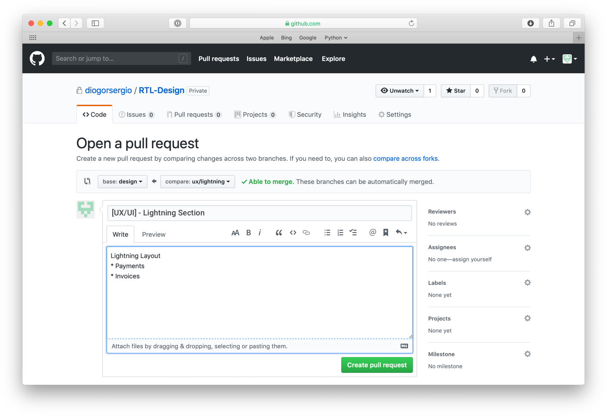</p><br>

#### Terminal
If you're quite comfortable with command line applications and prefer to interact with git that way, then this will give you an overview on how to do it.  

##### Step T1 - Clone the repo

```bash
# Open the directory to where you want to download the repository.
$ cd ~Documents

# Clone the repository.
$ git clone https://github.com/diogorsergio/RTL-Design.git

# Go into its directory.
$ cd RTL-Design
```
##### Step T2 - Switch to Design Branch
```bash
# You're now in the master branch, so let's switch to the design branch.
$ git checkout design
```

##### Step T3 - Create Feature Branch
```bash
# Always create feature branches based on design. Use prefixes accordingly ux/ or ui/.
# Name should follow prefix/featurename.
$ git checkout -b ux/lightning design
```
##### Step T4 - Do The Work
```bash
# At this point you are ready to start working.
# Make sure you follow the correct folder structure when creating your files.

# Check the status of the current branch, after working on it.
$ git status
```
##### Step T5 - Add and Commit Changes
When you finish a design iteration and are ready to show it to gather feedback, you will have to **commit** the changes you just made so they can be pushed to github for everyone to see. Commit titles should start with **[UX]** or **[UI]** accordingly to the work they include and a couple words describing the scope of the work.
```bash
# First you need to add the changes, you have just made.
# -A stands for --All.
$ git add -A

# Now that the files are added, you can commit them.
# The title should include the prefix followed by the scope of the work.
$ git commit -m '[UX] - Lightning Transactions'
```
##### Step T6 - Push Changes to Github
Once your changes are committed, they are still local and not available in github, to make them available for everyone you will have to push to publish this branch.
```bash
# You have to push them up-stream (-u) to origin
$ git push -u origin ux/lightning
```

##### Step T7 - Pull Request
The changes are now pushed and available for everyone to see in github, so the last step is to get them reviewed by the design team. In order to do this, you will have to create a **pull request**.
```bash
# When you pushed the commit the output should have been something similar to this.

remote: Create a pull request for 'ux/lightning' on GitHub by visiting:
remote: https://github.com/diogorsergio/RTL-Design/pull/new/ux/lightning

# You can just open the URL and it will open the Github with the Pull Request interface on it.
```
