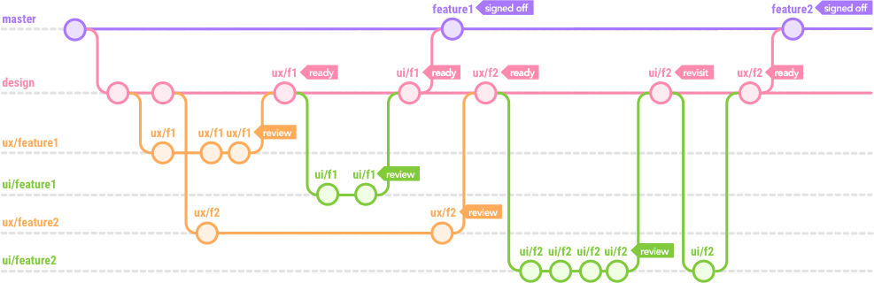
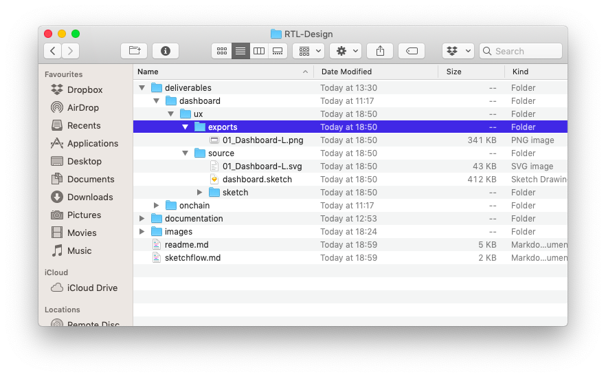
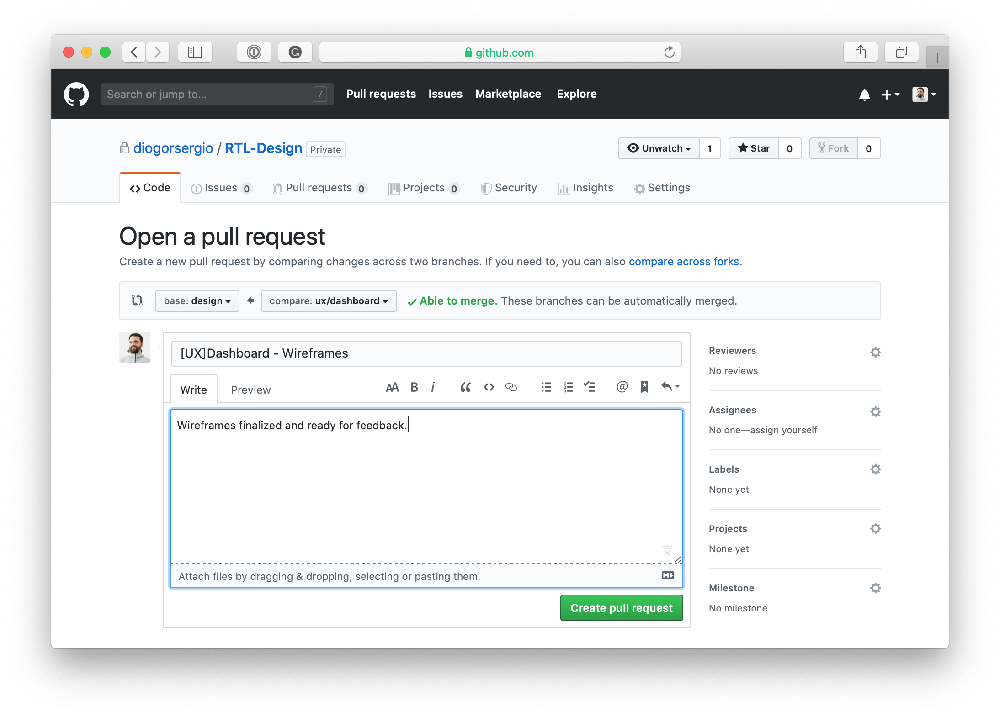

## Gitflow + Design

<p align="center"></p>

**Gitflow Design** is a git workflow based on the popular gitflow by [Vincent Driessen](https://nvie.com/posts/a-successful-git-branching-model/), but adapted to a design process.

We hope that with this workflow, design can now live side by side with development in git and take advantage of its versioning control capabilities that developers have been enjoying for years, but really missed by designers, and maybe we can finally end the `final_final_final.skech`.

Hopefully this is the first step to streamline collaboration between development and design, making it easy for people to contribute to open source projects, where usually the design process happens outside git and its not tracked.

This is very much a proof of concept and work in progress, but if you have any feedback feel free to get in touch.

## Getting Started
To start contributing to the design of RTL please follow the steps bellow.

### Prerequisites
You will need the following setup on your machine.
1. Git - https://git-scm.com/
2. Github Account - https://github.com

#### Installing git on macOS:
There are several ways to install Git on a Mac. The easiest is probably to install the Xcode Command Line Tools. On Mavericks (10.9) or above you can do this simply by trying to run git from the Terminal the very first time.

```bash
$ git --version
```
If you don’t have it installed already, it will prompt you to install it.

### How to Start

#### Setting up git
In order to start you will have to follow the steps bellow in the command line. If you are not familiar with Terminal, please have a look at this quick introduction by [Introduction to the Mac OS X Command Line](https://blog.teamtreehouse.com/introduction-to-the-mac-os-x-command-line) by Jim Hoskins @ Treehouse.

```bash
# First clone this repository.
$ git clone https://github.com/diogorsergio/RTL-Design.git

# Go into its directory.
$ cd RTL-Design

# You're now in the master branch, so let's switch to the design branch.
$ git checkout -b design master
```

In the design branch, if you want to start working on a new feature you will have to create a new sub-branch for it. You can do this by following the step bellow.
```bash
# Replace feature1 with the name of the feature e.g., ux/dashboard
$ git checkout -b ux/feature1 design
```

#### Folder Structure

This is the folder structure being used to keep things organised and manageable for all of us. Follow it.

When you are ready to work on a new feature, you have to create a specific feature folder inside `deliverables`. Note that we have two streams of work, `ux` and `ui` so use the appropriate folder name, and always include the `source`, `exports` folders as the structure above.


This is a real example of the RTL-Design folder (which might be outdated already). But its a snapshot how it looked and the folder structure in use.



#### File Formats
To keep the design workflow accessible to all, we are using open file formats that can also be tracked within git. You can use proprietary file formats but always keep a copy in an open file format such as **.SVG** in the `source` folder.

##### Sketch App
>With the launch of Sketch v43, the **.sketch** file format is now open, which means it can now be tracked within git. To see how you can use this file format please check this [.sketch workflow](https://github.com/diogorsergio/RTL-Design/blob/master/sketchflow.md) for RTL-Design.


#### Committing your changes
As you start to work on your designs, you can commit your changes to your local branch e.g., `ux/feature1` so you can later push them for review.

```bash
# Navigate to the RTL-Design folder.
$ cd RTL-Design

# Add the files to commit.
$ git add .

# Commit the files to push. Use this format for the message "[UX] - Feature1 / Notes".
$ git commit -m "[UX] - Feature1 / Layout Exploration"

# Rinse and repeat as you like.
```

#### Submitting your work for review
When you are ready to have your work reviewed, you will have to push your changes to the remote branch so everyone can see them and create a `pull request` to start the review process.

```bash
# Push your local branch to github so everyone can see it.
$ git push -u origin ux/feature1
```
The output will be something like this:
```bash
remote: Create a pull request for 'ux/feature1' on GitHub by visiting:
remote: https://github.com/diogorsergio/RTL-Design/pull/new/ux/feature1
```
Now you just have to open the link on your browser and open your `pull request`.

#### Open a pull request
On your browser you will have the `pull request` interface which is pretty self-explanatory. Things to keep in mind is you want to select the `design` branch into the `base:`  and your feature branch onto the `compare:`



Write a short description of the work you've done and anything else you think its worth mentioning, and when you're done click `Create pull request` and thats it!

Now you just have to wait until someone reviews it.
